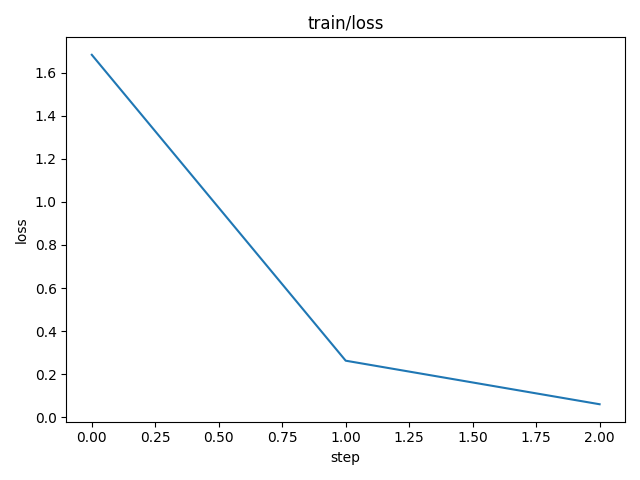
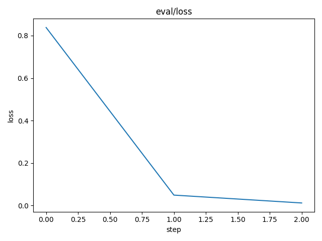

# DVC Report

params.yaml

| model      |   batch_size |   batch_per_epoch | frozen   |   frozen_idx | transforms                                                                                                           |
|------------|--------------|-------------------|----------|--------------|----------------------------------------------------------------------------------------------------------------------|
| Sequential |           64 |               343 | False    |            0 | [Pipeline: get_x -> PILBase.create, Pipeline: get_y -> Categorize -- {'vocab': None, 'sort': True, 'add_na': False}] |

metrics.json

| train                         | eval                           |   error_rate |   step |
|-------------------------------|--------------------------------|--------------|--------|
| {'loss': 0.06067444756627083} | {'loss': 0.011975251138210297} |   0.00200328 |      2 |

